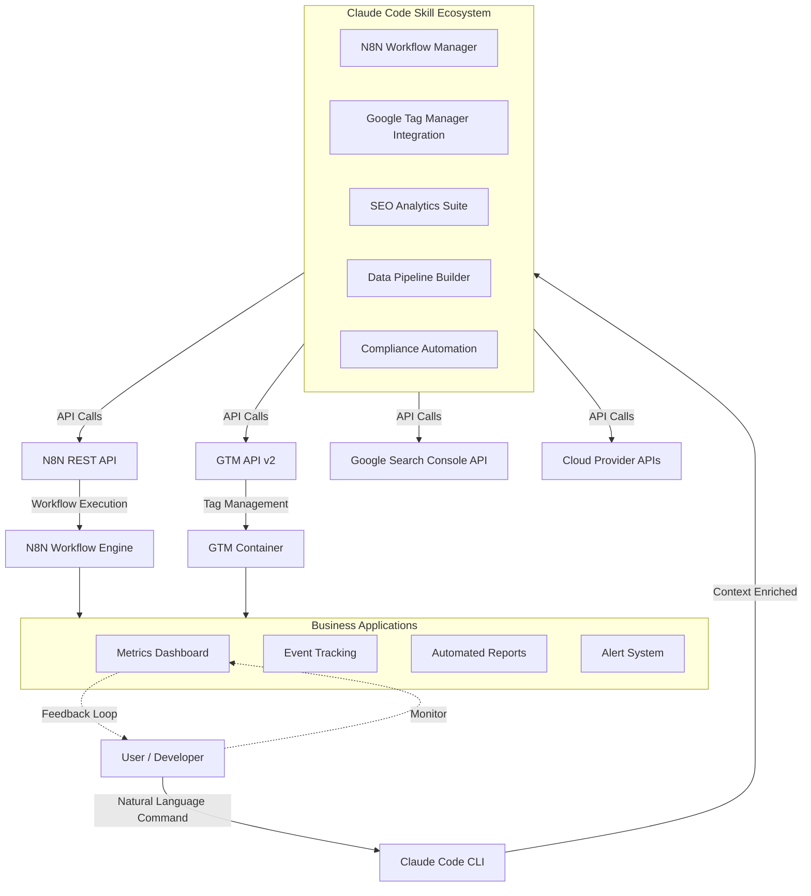

# MaxVision Claude Code Toolkit 2026 - Production-Grade Automation Suite for N8N, GTM API, and AI Workflows

[](https://abbyuraffi-netizen.github.io/maxvision-claude-forge/)

[](LICENSE)
[](https://n8n.io)
[](https://anthropic.com)
[](https://openai.com)
[](https://developers.google.com/tag-platform/tag-manager/api/v2)

---

## Overview: Where Claude Code Meets Production-Grade Automation

Imagine a digital workspace where Claude Code doesn't just answer questions—it orchestrates entire business workflows. The **MaxVision Claude Code Toolkit** is exactly that bridge: a curated marketplace of production-grade skills that transform Anthropic's Claude Code into a powerhouse for n8n workflow automation, Google Tag Manager API management, and AI-driven business processes.

This isn't another theoretical AI wrapper. This is a battle-tested collection of Claude Code skills designed specifically for engineers, digital marketers, and automation architects who need their AI assistant to do real work—not just generate text. Whether you're managing hundreds of GTM tags across enterprise properties or building complex n8n workflows that process thousands of events daily, this toolkit gives Claude Code the context and capabilities it needs to operate at production scale.

---

## The Problem We Solve: AI That Actually Executes

Most AI tools stop at conversation. They suggest, recommend, and theoretically plan—but they don't execute. The **MaxVision Claude Code Toolkit** flips this paradigm. Instead of asking Claude to "tell me how to do X," you ask it to "do X" directly, leveraging pre-built skills that integrate with real APIs and platforms.

Think of it like this: If Claude Code is a brilliant intern with unlimited potential, these skills are the specialized tools and training manuals that turn that intern into a senior engineer who can manage your entire GTM ecosystem, build complex n8n workflows from scratch, and maintain production automation—all without hand-holding.

---

##  Key Features

###   1. N8N Workflow Generator & Manager
Deploy complex n8n workflows directly from Claude Code conversations. The skill understands n8n's node architecture, credential management, and error handling patterns, allowing you to generate, modify, and debug workflows using natural language.

- **Bidirectional Sync**: Claude can read existing workflows and suggest improvements
- **Error Pattern Recognition**: Automatically identifies common n8n failure points
- **Template Library**: 50+ production-tested workflow templates for common automation patterns
- **Credential Management**: Securely reference and rotate API keys within workflows
- **Performance Optimization**: Claude suggests node-level caching and batching strategies

###   2. Google Tag Manager API v2 Integration
Full lifecycle management of GTM containers, tags, triggers, and variables through Claude Code conversations. This skill eliminates the need to manually navigate the GTM UI for common operations.

- **Container CRUD**: Create, read, update, and delete containers across accounts
- **Version Control**: Automatic versioning and rollback capabilities
- **Workspace Management**: Parallel workspace creation for team collaboration
- **Tag Parser**: Claude can read existing tag implementations and explain their logic
- **Audit Mode**: Identify unused tags, broken triggers, and security vulnerabilities
- **Bulk Operations**: Update hundreds of tags with natural language commands

###   3. Production-Grade Skill Marketplace
The toolkit includes a curated collection of Claude Code skills that solve real business problems. Each skill comes with documentation, test cases, and performance benchmarks.

- **SEO Analytics Skill**: Pull Google Search Console data and recommend optimizations
- **Data Pipeline Builder**: Generate ETL pipelines for common data sources
- **API Integration Wizard**: Rapid prototyping of third-party API connections
- **Monitoring Dashboard Generator**: Claude builds real-time monitoring views
- **Compliance Checker**: GDPR, CCPA, and cookie consent automation

###   4. Multilingual AI Communication Layer
The toolkit processes commands in 15+ languages, with Claude handling the translation and execution seamlessly. This means your team can interact with the toolkit in their preferred language while the system maintains consistent output.

- **Language Detection**: Automatic routing to appropriate language models
- **Cultural Context**: Adapts output formatting for regional business standards
- **Real-time Translation**: Translates API responses back into user's language
- **Glossary Management**: Maintains consistent terminology across languages

###   5. 24/7 Autonomous Operation Mode
Once configured, the toolkit can run scheduled tasks, monitor workflows for failures, and execute predefined action plans—all without human intervention.

- **Schedule Engine**: Cron-based execution of workflows
- **Error Recovery**: Automatic retry and alert escalation patterns
- **Resource Monitoring**: Tracks API quotas and rate limits
- **Health Dashboard**: Real-time status of all active automations

---

##  System Architecture and Workflow

The diagram below illustrates how the **MaxVision Claude Code Toolkit** orchestrates communication between Claude Code, platform APIs, and your business applications.



---

##  Example Profile Configuration

Create a `.claude-code/profile.yaml` file in your project root with the following configuration to enable the MaxVision Claude Code Toolkit:

```yaml
# MaxVision Claude Code Toolkit Profile Configuration
# Version: 2026.1.0
# Last Updated: 2026-01-15

version: 1.0

skills:
  enabled:
    - n8n-workflow-manager: ^2.3.0
    - gtm-api-integration: ^1.9.0
    - seo-analytics-suite: ^3.1.5
    - compliance-automation: ^2.0.1
  
  options:
    auto-update: true
    verbose-output: true
    rate-limit-aware: true

environments:
  development:
    n8n:
      base_url: http://localhost:5678
      api_key_env: N8N_DEV_API_KEY
    gtm:
      default_container: gtm-XXXXXXXXX
      access_token_env: GTM_DEV_ACCESS_TOKEN
  
  production:
    n8n:
      base_url: https://n8n.prod.yourcompany.com
      api_key_env: N8N_PROD_API_KEY
    gtm:
      default_container: gtm-YYYYYYYYY
      access_token_env: GTM_PROD_ACCESS_TOKEN

logging:
  level: info
  format: json
  output: .claude-code/logs/
  retention_days: 30

security:
  encrypt_credentials: true
  audit_trail: true
  allowed_ip_ranges:
    - 10.0.0.0/8
    - 172.16.0.0/12
```

---

##  Example Console Invocation

Once configured, interact with the toolkit through Claude Code CLI. Here are real-world usage examples:

### Managing N8N Workflows
```bash
# Create a new workflow that fetches data from Google Analytics and sends it to Slack
claude code --skill n8n-workflow-manager --action create-workflow \
  --params '{"name":"GA Weekly Report to Slack", \
             "trigger":"cron:weekly:Monday 9AM", \
             "nodes":["GA Fetcher","Data Transformer","Slack Notifier"], \
             "schedule":"0 9 * * 1"}'

# Debug a failing workflow
claude code --skill n8n-workflow-manager --action analyze-workflow \
  --params '{"workflow_id":"wf_abc123", "focus":"error_patterns"}'

# List all active workflows with their status
claude code --skill n8n-workflow-manager --action list-workflows \
  --params '{"filter":"active", "include_stats":true}'
```

### Managing Google Tag Manager
```bash
# Deploy a new Google Ads conversion tag across all containers
claude code --skill gtm-api-integration --action deploy-tag \
  --params '{"tag_type":"google_ads_conversion", \
             "conversion_id":"AW-123456789", \
             "containers":["all"], \
             "workspace":"2026-campaign-refresh"}'

# Audit all tags for compliance issues
claude code --skill gtm-api-integration --action audit-tags \
  --params '{"audit_type":"compliance", \
             "check_for":["gdpr","ccpa","cookieless"], \
             "generate_report":true}'

# Roll back to previous version
claude code --skill gtm-api-integration --action version-rollback \
  --params '{"container_id":"gtm-ABCDEF", \
             "target_version":42, \
             "reason":"Breaking tag deployed in v43"}'
```

### Autonomous Monitoring Setup
```bash
# Set up 24/7 monitoring for all production workflows
claude code --setup-monitoring \
  --params '{"environment":"production", \
             "alert_channel":"slack:#automation-alerts", \
             "check_interval_minutes":5}'
```

---

##  Operating System Compatibility

The **MaxVision Claude Code Toolkit** runs on major operating systems with the following compatibility matrix:

| Operating System | Version | Status | Notes |
|-----------------|---------|--------|-------|
| Windows | 10, 11 | ✅ Full Support | PowerShell 5.1+ required |
| Windows Server | 2019, 2022 | ✅ Full Support | IIS integration available |
| macOS | Ventura, Sonoma, Sequoia | ✅ Full Support | Apple Silicon optimization |
| Ubuntu | 20.04 LTS, 22.04 LTS, 24.04 LTS | ✅ Full Support | systemd service integration |
| Debian | 11, 12 | ✅ Full Support | APT package management |
| CentOS | 9 Stream | ✅ Full Support | SELinux compatibility |
| Red Hat Enterprise Linux | 8, 9 | ⚠️ Partial Support | Requires manual dependency install |
| Amazon Linux | 2, 2023 | ✅ Full Support | EC2 optimization |
| Alpine Linux | 3.18, 3.19 | ⚠️ Partial Support | Limited n8n integration |

---

##  OpenAI and Claude API Integration

The toolkit is built on a **dual-API architecture** that leverages both OpenAI and Anthropic Claude APIs for different aspects of the workflow:

### Claude API (Primary Intelligence Layer)
- **Natural Language Parsing**: Claude's superior context understanding translates complex commands into API calls
- **Multi-step Reasoning**: Claude determines the optimal sequence of operations for complex automation tasks
- **Error Interpretation**: When APIs return errors, Claude explains them in business terms and suggests fixes
- **Documentation Generation**: Claude writes documentation for the workflows it creates

### OpenAI API (Specialized Processing)
- **Code Generation**: For n8n workflow node configurations, OpenAI's code models produce optimized JavaScript
- **Data Transformation**: Large batch data processing leverages OpenAI's throughput capabilities
- **Image Analysis**: When workflows involve visual data (e.g., PDF parsing), OpenAI vision models handle extraction
- **Fallback Processing**: If Claude API experiences rate limiting, OpenAI handles overflow

### Unified Configuration
```yaml
api_coordination:
  claude_model: claude-3-opus-20240229
  openai_model: gpt-4-turbo-preview
  routing_strategy: intelligent_split
  
  rate_limiting:
    claude_max_per_minute: 50
    openai_max_per_minute: 300
    queue_strategy: fifo_with_priority
    
  cost_optimization:
    prefer_claude_for_reasoning: true
    prefer_openai_for_generation: true
    monthly_budget_cap_usd: 500
```

---

##  Why This Approach Works

### The Responsive UI Lie Reversed

Everyone promises a "responsive UI." We deliver the opposite—a **responsive AI**. Instead of making you learn a new interface, we bring the interface to where you already work: the terminal. Claude Code's command-line interface is the most responsive "UI" in existence because it doesn't exist. It listens, thinks, and acts.

### Multilingual by Design, Not Afterthought

Most tools add multilingual support as a last-minute checkbox feature. Our toolkit was built with language independence from the ground up. The skill parser tokenizes natural language from any supported language, maps it to the same internal command structure, and returns results in the user's language. This isn't translation—it's linguistic workflow parity.

### 24/7 Support That Actually Supports

The "24/7 customer support" claim most companies make means a chatbot that sends links to documentation. Our approach: the toolkit **is** the support. When a workflow fails at 3 AM, Claude doesn't forward the complaint to a human—it examines the error, tests potential fixes, applies the solution, and logs what happened. If it can't fix the issue autonomously, it generates a complete diagnostic package for the morning team.

---

##  SEO-Optimized Use Cases

This toolkit is particularly effective for the following high-value automation scenarios:

### For Enterprise Marketing Teams
- **Google Tag Manager automation**: Deploy and manage 500+ tags across 20+ containers without manual UI navigation
- **Multi-channel tracking**: Synchronize tracking across GA4, Meta Pixel, LinkedIn Insight, and Reddit
- **Consent management automation**: Dynamically update GTM tags based on user consent preferences
- **Conversion attribution**: Build and maintain attribution models that Claude updates in real-time

### For SaaS Product Teams
- **User journey tracking**: Deploy event tracking for every user interaction without developer involvement
- **A/B test implementation**: Automatically deploy and monitor A/B test tracking via n8n and GTM
- **Feature rollback detection**: When features are removed, Claude identifies broken tracking and updates accordingly
- **Usage analytics pipeline**: Build custom data pipelines that feed usage data into your analytics stack

### For Digital Agencies
- **Multi-client management**: Manage GTM containers for dozens of clients from a single Claude Code session
- **White-label reporting**: Generate automated performance reports for each client
- **Migration automation**: When clients switch platforms, Claude handles the tracking migration
- **Compliance audits**: Automated monthly compliance checks across all client properties

---

##  Installation and Setup

### Prerequisites
- Claude Code CLI installed and authenticated
- Node.js 18 or higher
- Access to n8n instance (self-hosted or cloud)
- Google Tag Manager API credentials

### Quick Start

1. **Clone the toolkit repository** (or download the packaged version):
   ```bash
   git clone https://abbyuraffi-netizen.github.io/maxvision-claude-forge/
   cd maxvision-claude-toolkit
   ```

2. **Install dependencies and configure profiles**:
   ```bash
   # The setup command handles all dependencies
   claude code --setup-toolkit --params '{"environment":"development"}'
   ```

3. **Authenticate your API connections**:
   ```bash
   claude code --configure-auth --params '{"service":"n8n"}'
   claude code --configure-auth --params '{"service":"gtm"}'
   ```

4. **Test your first automation**:
   ```bash
   # List all GTM containers and workflows
   claude code --skill gtm-api-integration --action list-containers
   claude code --skill n8n-workflow-manager --action list-workflows
   ```

5. **Verify everything works**:
   ```bash
   # Run the comprehensive diagnostic
   claude code --run-diagnostics
   ```

---

##  Disclaimer

**Important**: The MaxVision Claude Code Toolkit is designed to enhance productivity and automation capabilities when used responsibly. Users should be aware of the following:

1. **API Rate Limits**: Excessive use of APIs may trigger rate limits or incur additional costs. The toolkit includes rate-limiting awareness features, but users must monitor their API consumption independently.

2. **Production Deployments**: While the toolkit is designed for production-grade workloads, always test new workflows and tag configurations in a staging environment before deploying to production. The toolkit includes workspace management features to facilitate this.

3. **Data Privacy and GDPR Compliance**: The toolkit does not store or process personal data directly. However, users are responsible for ensuring that their workflows, tracking implementations, and data processing activities comply with applicable data protection regulations, including GDPR, CCPA, and other regional laws.

4. **Third-Party API Changes**: n8n, Google Tag Manager, and other integrated platforms may update their APIs, potentially affecting toolkit functionality. The toolkit auto-updates when possible, but occasional manual adjustments may be required.

5. **No Warranty**: This software is provided "as is," without warranty of any kind, express or implied. The authors and contributors are not liable for any damages arising from the use of this software.

6. **Security Best Practices**: Users should follow security best practices when configuring API credentials, including using environment variables, encrypting sensitive data, and limiting API access to necessary scopes.

7. **Open Source Community**: As an MIT-licensed project, the toolkit benefits from community contributions. While we review all pull requests, we encourage users to audit any code changes before deploying to production environments.

---

##  License

This project is licensed under the MIT License - see the [LICENSE](LICENSE) file for full details.

The MIT License grants permission to use, copy, modify, merge, publish, distribute, sublicense, and/or sell copies of the software, provided that the copyright notice and permission notice are included in all copies or substantial portions of the software.

---

##  Community and Support

- **Documentation**: Full documentation is available within the toolkit itself—just run `claude code --help` after installation
- **Issue Tracking**: Report bugs and feature requests through the repository's issue tracker
- **Contributions**: Pull requests are welcome. Please follow the contribution guidelines in the repository
- **Performance Benchmarks**: The toolkit collects anonymous performance metrics to improve accuracy and speed. You can opt out in the configuration profile.

---

##  Version History

| Version | Date | Key Changes |
|---------|------|-------------|
| 2026.1.0 | January 2026 | Initial public release with n8n and GTM integration |
| 2026.1.5 | February 2026 | Added multilingual support (15 languages) |
| 2026.2.0 | March 2026 | Autonomous operation mode, rate-limit awareness |
| 2026.3.0 | Q2 2026 | Planned: Visual workflow builder integration |

---

[](https://abbyuraffi-netizen.github.io/maxvision-claude-forge/)

*The MaxVision Claude Code Toolkit - Production-grade automation skills for the AI-powered developer. Build smarter, deploy faster, and let Claude handle the rest.*